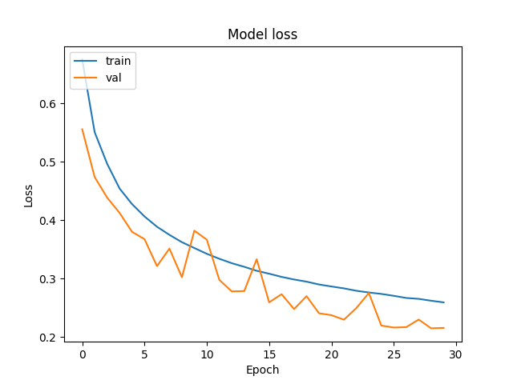

# About 

Training and evaluation for forest cover dataset with 4 diffrent models and simple API.

# Training and evaluation

To train provided model there is a class in utils.py called CoverTypeTrain.

Example:

```python
from utils import CoverTypeTrain

train = CoverTypeTrain()
train.load_data()
train.knn(neighbors=5, path_to_save='./models/knn_model.pkl')

```
To evaluate:

```python
from utils import CoverTypeEvaluate

evaluate = CoverTypeEvaluate(X_test=train.X_test,
                             y_test=train.y_test,
                             knn_path='./models/knn_model.pkl')
accuracy = evaluate.metrics(model_name='knn', metric='accuracy')
print(accuracy)

```

# Run API

```bash

git clone https://github.com/filnow/forest-cover.git
cd forest-cover
pip install -r requirements.txt
python3 app.py

```
## Example request in python

Data comes from first row of the dataset that is labeled as 5.

```python
import requests
import json

url = 'http://localhost:5000/' 

input_data = {
    'Elevation': 2596,
    'Aspect': 51,
    'Slope': 3,
    'Horizontal_Distance_To_Hydrology': 258,
    'Vertical_Distance_To_Hydrology': 0,
    'Horizontal_Distance_To_Roadways': 510,
    'Hillshade_9am': 221,
    'Hillshade_Noon': 232,
    'Hillshade_3pm': 148,
    'Horizontal_Distance_To_Fire_Points': 6279,
    'Wilderness_Area': 1,
    'Soil_Type': 29
}

input_data_json = json.dumps(input_data)

response = requests.get(url, params={'model': 'knn', 'inputs': input_data_json})

print(response.text)
```

# Summary of models


## Heuristic

Simple heuristic method that based on elevation (first column).
Elevation is a feature that determines the height above sea level, it is given in meters.
I chose this trait after analyzing the plot below.


I used a violin plot to visualize the relationship between labels and elevation.
We can see that most labels are in range of elevation that we can define.
For example label number 7 (Krummholz) is in the range 3200-3500.
However, we can also note that the range of label number 3 is almost the same as number 6.
This may be one of the main reasons why this model achieves low accuracy on the test set, as only 45%.


## K-Nearest Neighbors (KNN)

Algorithm performs very well with default arguments and without standardization.
Number of neighbors was set to 3 after analyzing plot below.


My pure intuition for choosing this model was that it makes sense that trees of the same type would be located near each other in a forest.

Model achieves around 98% accuracy on test set.


## Random Forest (RF) 

The best performing model, all arguments expect estimators are set to default.
Standardization is done with StandardScaler.
The number of estimators was set to 120 for best accuracy after analyzing plot below although 50 would be probably better for speed.


Model achieves around 99% accuracy on test set.

A forest for a forest makes sense.


## Neural Network (NN)

Firstly, I found the best hyper-parametrs using keras-tuner library.
The description of that can be found in /models/hyperparametrs directory.
Then I trained net for 30 epochs on the training set, plots below show the process




Model achieves around 91% accuracy on test set.


# Evaluation

## Accuracy


## Confusion matrix


